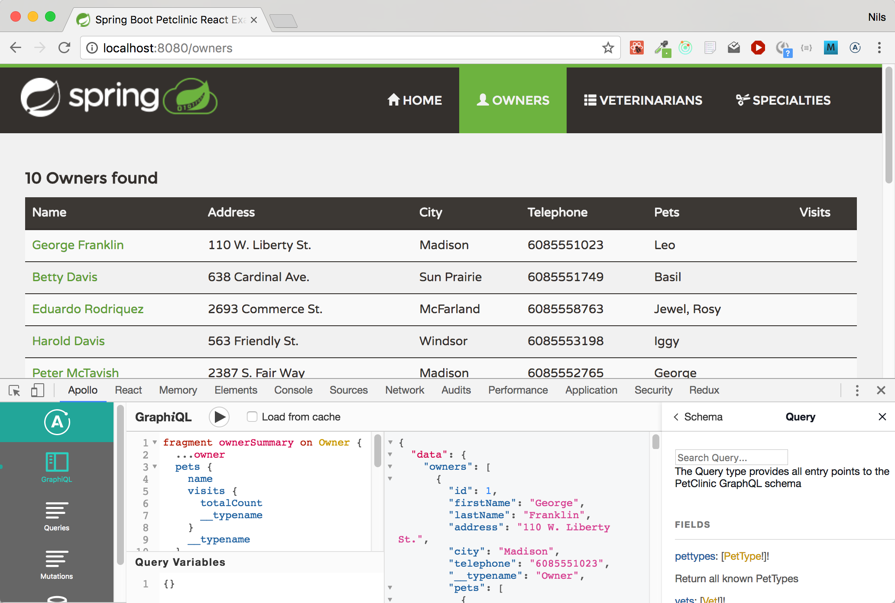

**NOTE** There is a **new** experimental version using the new **spring-graphql** project. You can find that example on the [spring-graphql branch](https://github.com/spring-petclinic/spring-petclinic-graphql/tree/spring-graphql) in this repository.


# GraphQL version of Spring PetClinic Sample Application

This is a [GraphQL API](http://graphql.org/) version of the Spring PetClinic Application. It consists of two parts:

* The Spring Boot-based backend, that uses the graphql-java implementation for the server-side GraphQL Api implementation
* The React-based frontend, that uses React Apollo for running GraphQL queries.

**Note** This project is in very early stage and has much room for improvement! If you like to help, I'd be more than happy! 
You can for example open [an issue](https://github.com/spring-petclinic/spring-petclinic-graphql/issues) for discussing things or a [Pull Request](https://github.com/spring-petclinic/spring-petclinic-graphql/pulls) to contribute. 

## The Backend
 
The backend code in this repository is based on the Rest example
https://github.com/spring-petclinic/spring-petclinic-rest. Instead of the
`org.springframework.samples.petclinic.rest` package it contains
a `org.springframework.samples.petclinic.graphql` package that contains
the resolvers for the GraphQL API.

### GraphQL Java implementation

GraphQL frameworks used in this example:
 
 * [graphql-java-tools](https://github.com/graphql-java/graphql-java-tools)
 * [graphql-spring-boot](https://github.com/graphql-java/graphql-spring-boot)

## The frontend

The frontend is implemented in [TypeScript](http://www.typescriptlang.org/) and uses [React](https://facebook.github.io/react/) for
the UI.

GraphQL frameworks used in the frontend:

* [React Apollo](http://dev.apollodata.com/react/)
* [Apollo GraphQL code generator](https://github.com/apollographql/apollo-codegen) for generating TypeScript types for the queries (only at development time) 

## Running petclinic locally
First clone the application:

```bash
git clone https://github.com/spring-petclinic/spring-petclinic-graphql.git
```

Then build and start the SpringBoot backend using Maven:

```bash
cd spring-petclinic-graphql/backend
./mvnw spring-boot:run
```

Finally build and start the frontend:

```bash
cd spring-petclinic-graphql/frontend
# install dependencies
yarn install
	
# start application
yarn start
```

After running you can access:
* The [GraphiQL explorer](https://github.com/graphql/graphiql): [http://localhost:9977/](http://localhost:9977/)
* The frontend: [http://localhost:8080/](http://localhost:8080/) (In case something else runs on Port 8080 another 
port like 8081 is automatically chosen)



# Background: GraphQL

You can find some slides with some GraphQL background informations here: https://spring-petclinic.github.io/spring-petclinic-graphql/talk/graphql-introduction.html 

# Contributing

If you like to help and contribute you're more than welcome! Please open [an issue](https://github.com/spring-petclinic/spring-petclinic-graphql/issues) or a [Pull Request](https://github.com/spring-petclinic/spring-petclinic-graphql/pulls)
 
# Contact

You can find [me](https://nilshartmann.net) on [Twitter](https://twitter.com/nilshartmann).

# From the original PetClinic README

## Understanding the Spring Petclinic application with a few diagrams
<a href="https://speakerdeck.com/michaelisvy/spring-petclinic-sample-application">See the presentation here</a>


## Database configuration

(Note: this is unrelated to GraphQL)

In its default configuration, Petclinic uses an in-memory database (HSQLDB) which
gets populated at startup with data.
A similar setups is provided for MySql and PostgreSQL in case a persistent database configuration is needed.
To run petclinic locally using persistent database, it is needed to change profile defined in application.properties file.

For MySQL database, it is needed to change param "hsqldb" to "mysql" in string
```
spring.profiles.active=hsqldb,spring-data-jpa
```
 defined in application.properties file.

Before do this, would be good to check properties defined in application-mysql.properties file.

```
spring.datasource.url = jdbc:mysql://localhost:3306/petclinic?useUnicode=true
spring.datasource.driverClassName = com.mysql.jdbc.Driver
spring.datasource.username=root 
spring.datasource.password=petclinic 
spring.datasource.driver-class-name=com.mysql.jdbc.Driver 
spring.jpa.database=MYSQL 
spring.jpa.database-platform=org.hibernate.dialect.MySQLDialect
spring.jpa.hibernate.ddl-auto=none
```      

You may also start a MySql database with docker:

```
docker run --name mysql-petclinic -e MYSQL_ROOT_PASSWORD=petclinic -e MYSQL_DATABASE=petclinic -p 3306:3306 mysql:5.7.8
```

For PostgeSQL database, it is needed to change param "hsqldb" to "postgresql" in string
```
spring.profiles.active=hsqldb,spring-data-jpa
```
 defined in applcation.properties file.

Before do this, would be good to check properties defined in application-postgresql.properties file.

```
spring.datasource.url=jdbc:postgresql://localhost:5432/petclinic
spring.datasource.driverClassName=org.postgresql.Driver
spring.datasource.username=postgres
spring.datasource.password=petclinic
spring.datasource.driver-class-name=org.postgresql.Driver
spring.jpa.database=POSTGRESQL
spring.jpa.database-platform=org.hibernate.dialect.PostgreSQLDialect
spring.jpa.hibernate.ddl-auto=none
```
You may also start a Postgres database with docker:

```
docker run --name postgres-petclinic -e POSTGRES_PASSWORD=petclinic -e POSTGRES_DB=petclinic -p 5432:5432 -d postgres:9.6.0
```
